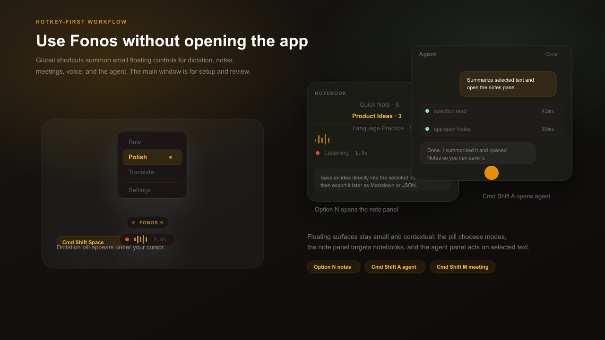
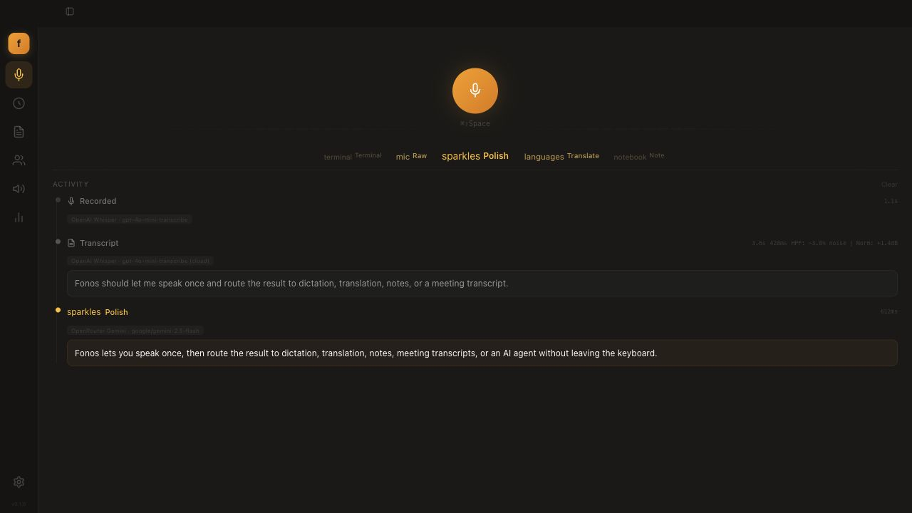
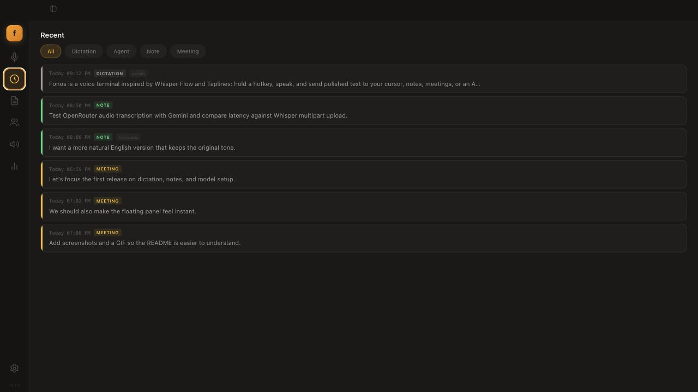
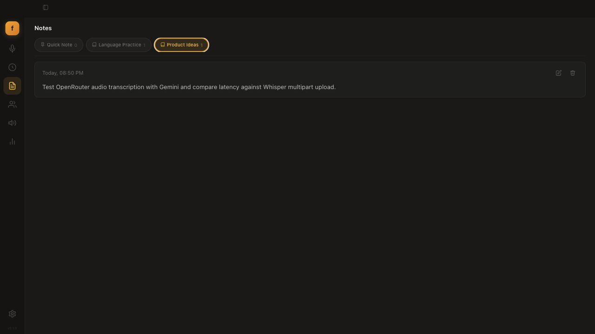
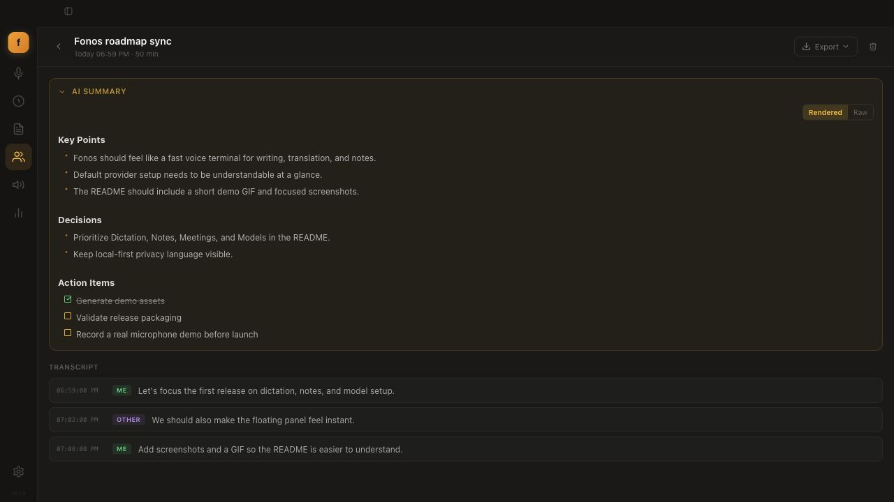
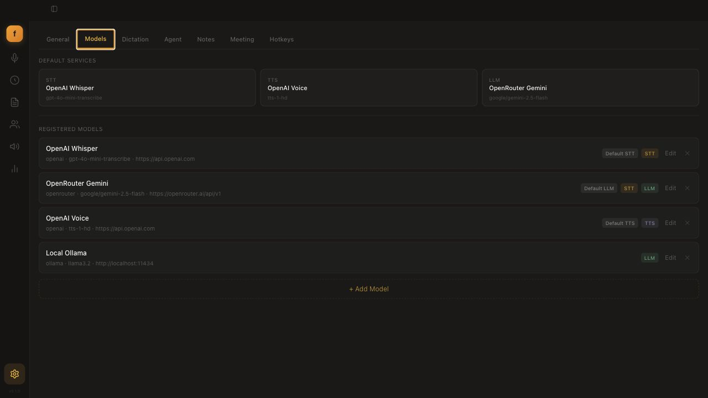

# Fonos

**A voice terminal for macOS and Linux.** Inspired by Whisper Flow and Taplines, Fonos lets you hold a hotkey, speak naturally, and send the result to the place you actually need it: the cursor, clipboard, a notebook, a meeting transcript, text-to-speech, or an AI agent.


Fonos is **open source, local-first, and provider-agnostic**. Bring your own API keys for OpenAI, Anthropic, Google, OpenRouter, and more, or run locally with Ollama / LM Studio. Your keys, transcripts, notebooks, and meeting notes stay on your machine.

## What it does

- **Dictate anywhere:** press-and-hold to record, release to transcribe, then optionally clean, rewrite, translate, or paste.
- **Stay out of the main window:** global hotkeys summon floating controls, so most captures happen without opening the full app.
- **Turn speech into structured notes:** route voice captures into notebooks with custom prompts and export to Markdown or JSON.
- **Capture meetings:** record mic + system audio as separate speaker channels, then generate an AI summary with decisions and action items.
- **Configure your own model stack:** mix cloud and local STT, LLM, and TTS providers per mode, notebook, or workflow.
- **Use your voice as an agent input:** talk to an AI agent with allow/block lists for tool execution.

## Hotkey-first floating controls

Fonos is designed to live under your shortcuts, not as a window you constantly manage. Use the global hotkeys to bring up small, contextual surfaces:

- **Float pill:** appears near the cursor for dictation, recording state, processing state, and quick mode switching.
- **Mode roller:** switch between Raw, Polish, Translate, Note, or custom modes without opening Settings.
- **Note panel:** pick a notebook and capture directly into it from a compact floating panel.
- **Agent panel:** talk to the agent or act on selected text, with tool execution shown inline.



## Screenshots

| Dictation activity | Recent timeline |
|---|---|
|  |  |

| Voice notes | Meeting summary |
|---|---|
|  |  |

| Model setup |
|---|
|  |

## Features

### 🎙️ Dictation
Press-and-hold to record, release to process. Each *mode* is a transcription plus an optional LLM pass with its own prompt.

- Built-in modes: **Raw** (verbatim), **Polish** (natural writing), **Formal**, **Translate**, **Clean** (filler removal).
- Unlimited **custom modes** — your own system prompt, template, temperature, model override, and auto-paste behavior.
- Live activity feed with model + latency, animated waveform, and a horizontal mode selector.

### 📓 Voice Notes
Organize recordings into notebooks.

- **Quick Note** catch-all plus unlimited custom notebooks, each with its own STT/LLM model, processing mode, and prompt.
- Bind up to 3 notebooks to dedicated hotkeys; capture from a compact floating panel.
- Export any notebook to Markdown or JSON.

### 👥 Meeting Capture
Real-time transcription with separate speaker channels.

- **Dual capture** — your mic and system audio (remote participants, via ScreenCaptureKit) are transcribed independently.
- Live timestamped transcript panel, plus an **AI summary** with key points, decisions, and checkable action items when you stop.

### 🤖 Agent
Voice-driven AI conversations with tool execution.

- Hold a hotkey to talk; responses stream with thinking indicators.
- Skill execution with allow/block command lists; optional spoken (TTS) replies.

### 🔊 Voice (TTS & cloning)
- Type or paste text, pick a voice, adjust speed (0.5×–2×), and synthesize.
- **Clone a voice** from a 3–10s recording or an uploaded clip.

### 📊 Stats & Recent
- Usage over 7 / 30 / 90 days: words dictated, session counts, estimated time saved.
- A unified, filterable timeline across dictation, agent, notes, and meetings.

## Install

### macOS
Download the latest **`.dmg`** from [Releases](https://github.com/ethannortharc/fonos/releases/latest), open it, and drag Fonos to Applications. **Apple Silicon, macOS 13.0+.** Signed and notarized — no Gatekeeper workaround needed.

### Linux
Download the **`.deb`** or **`.rpm`** (amd64 / arm64) from [Releases](https://github.com/ethannortharc/fonos/releases/latest):

```bash
sudo apt install ./fonos_*.deb    # Debian / Ubuntu
sudo dnf install ./fonos-*.rpm    # Fedora / RHEL
```

Text injection (paste-at-cursor) needs **`xdotool`** (`sudo apt install xdotool`). On Wayland it works via XWayland.

## Build from source

**Prerequisites**

- [Rust](https://rustup.rs) (stable) and the Tauri CLI — `cargo install tauri-cli --version "^2"`
- [Node.js](https://nodejs.org) 20+
- **macOS:** Xcode Command Line Tools (`xcode-select --install`) — provides `swiftc` for the Speech / ScreenCaptureKit helpers
- **Linux:** the system packages listed in [`.github/workflows/build-linux.yml`](.github/workflows/build-linux.yml) (`libwebkit2gtk-4.1-dev`, `libgtk-3-dev`, `libasound2-dev`, …)

**Run it**

```bash
git clone https://github.com/ethannortharc/fonos.git
cd fonos/fonos-desktop
npm ci
cargo tauri dev          # hot-reloading dev build
```

**Package a release** — `.app` / `.dmg` on macOS, `.deb` / `.rpm` on Linux:

```bash
cargo tauri build
```

The compiled macOS helper binaries are checked in, so builds work out of the box. To rebuild them after editing the Swift sources:

```bash
./src-tauri/swift/build.sh   # macOS only
```

## Providers

Configure any mix in **Settings → Models** — set global defaults, then override per-mode or per-notebook.

| Provider | Type | Notes |
|----------|------|-------|
| **OpenAI** | STT · TTS · LLM | Whisper, GPT-4o, TTS-1 |
| **OpenRouter** | STT · LLM | Audio-capable models (Gemini, Voxtral, GPT-Audio) via chat completions |
| **Anthropic** | LLM | Claude models |
| **Google** | LLM | Gemini models |
| **Ollama** | STT · LLM | Local (`localhost:11434`) |
| **LM Studio** | LLM | Local (`localhost:1234`) |
| **OMLX** | STT · LLM | Local (`localhost:8000`) |
| **Custom** | Any | Any OpenAI-compatible endpoint |

STT supports two API paths: **Whisper** multipart upload, or **chat-completions** base64 audio for multimodal models.

## Keyboard shortcuts

All remappable in **Settings → Hotkeys**.

| Shortcut | Action |
|----------|--------|
| `Cmd+Shift+Space` | Dictation (hold) |
| `Cmd+Shift+S` | Text-to-speech |
| `Cmd+Shift+A` | Agent (hold) |
| `Cmd+Shift+G` | Toggle agent panel |
| `Option+N` | Note panel (hold) |
| `Cmd+Shift+M` | Toggle meeting capture |
| `Option+1/2/3` | Quick notebooks |

## Repository layout

Fonos is a monorepo. This README focuses on the **desktop app**.

| Path | What it is |
|------|------------|
| [`fonos-desktop/`](fonos-desktop) | The Tauri desktop app — Rust backend + React / TypeScript UI. |
| [`fonos-core/`](fonos-core) | Platform-independent Rust crate: provider clients (STT/TTS/LLM), modes, meetings, storage, agent, stats. Shared by the apps. |
| [`fonos-ios/`](fonos-ios) | SwiftUI companion app for iOS (app + keyboard extension + widget + App Intents). |
| [`assets/`](assets) | README screenshots and demo media. |

## Tech stack

**Desktop:** Tauri 2 · Rust · React 19 · TypeScript · Vite · Tailwind CSS · SQLite (`rusqlite`). macOS speech and system-audio capture run through small Swift helpers built on `Speech` and `ScreenCaptureKit`.

## Contributing

Issues and pull requests are welcome. Run the tests with:

```bash
cargo test                              # Rust (core + desktop)
cd fonos-desktop && npm run test:e2e    # Playwright end-to-end
```

Some desktop tests need microphone / accessibility permissions. Please keep changes focused and match the surrounding style.

## License

[MIT](LICENSE) © Ethan
