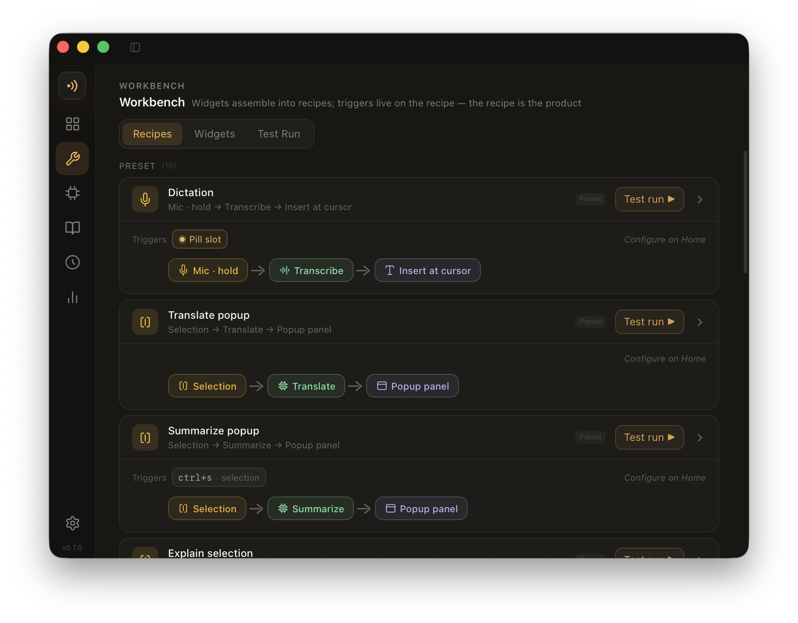
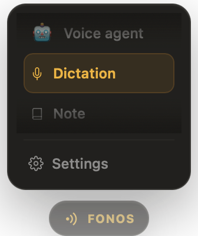
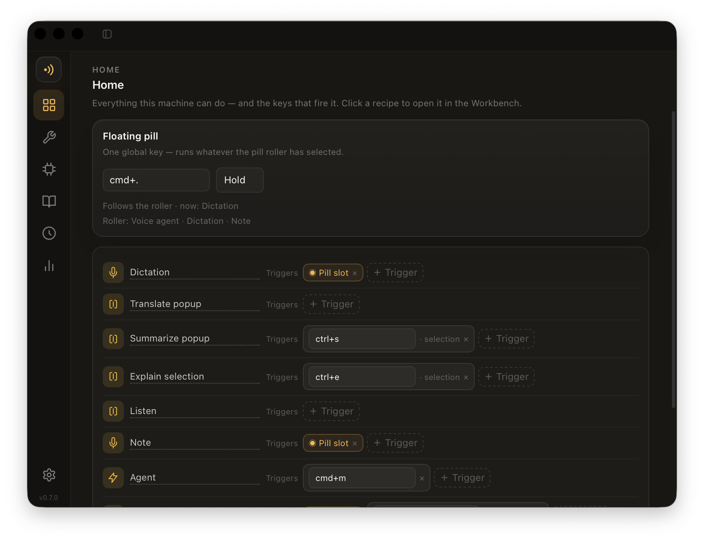
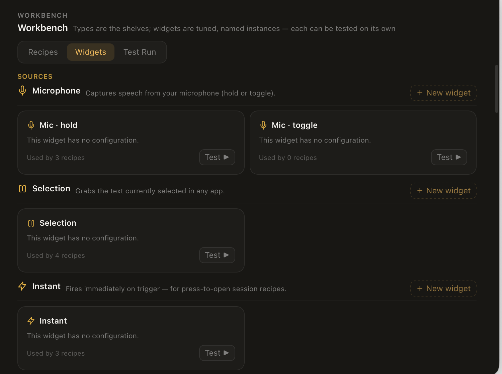
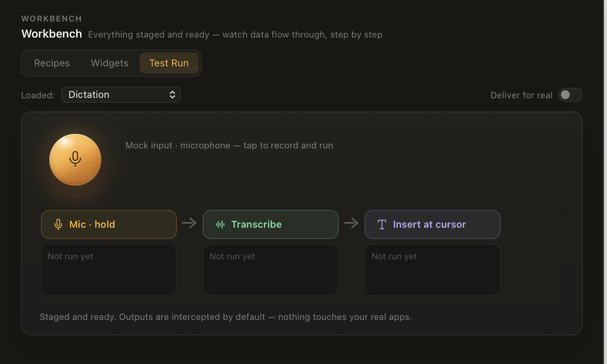

# Fonos

**Turn speech and selected text into reusable recipes that run in any app.**

Fonos is an open-source, hotkey-first personal productivity tool for voice and
text workflows on macOS and Linux. It combines dictation, speech-to-text,
prompt-driven LLM processing, text-to-speech, desktop delivery, and session
tools in one local-first system.

The point is not to add another chat window. It is to bring the voice and text
operations you already use into the app where you are working, with your own
prompts, vocabulary, models, hotkeys, and output behavior.




_The real v0.7 desktop app. Each card is a runnable recipe; the screenshot
shows one personal setup, and every trigger is remappable._

## The Core Idea: Recipes

Most everyday voice and text tasks have the same shape:

```text
input -> processing steps -> one or more outputs
```

Fonos makes each part explicit and reusable.

| Layer | Built-in building blocks |
|---|---|
| **Input** | Hold or toggle the microphone, use selected text, or start a session instantly. |
| **Process** | Transcribe speech, polish writing, translate, summarize, explain, or run your own prompt. |
| **Output** | Insert at the cursor, replace the selection, copy, show a popup or dialog, save to a notebook, speak, or start a session tool. |
| **Trigger** | Attach global hotkeys, or place microphone recipes in the floating pill's roller. |

A recipe can be as direct as:

```text
Mic (hold) -> Transcribe -> Insert at cursor
```

or more personal:

```text
Mic -> Transcribe with my vocabulary -> Polish with my prompt -> Insert
Selection -> Translate to English -> Replace selection
Selection -> Explain -> Dialog
Selection -> Summarize -> Speak
Mic -> Transcribe -> Save to project notebook
```

Components are shared. Change a model, prompt, vocabulary book, voice, or
delivery rule once, and every recipe that references it can use the update.

## Why This Is Useful

Translation, rewriting, and summarization are not hard to find. The friction is
leaving Teams, Mail, a browser, a PDF, or an editor; opening an AI tool; moving
text back and forth; and repeating the same prompt and cleanup every time.

Fonos removes those transfer steps. The work happens where the text already is,
and the result goes where it is needed.

| Everyday use | Example recipe | What happens |
|---|---|---|
| **Dictate anywhere** | `Mic -> STT -> Polish -> Insert` | Speak naturally; Fonos removes speech artifacts and writes at the cursor. |
| **Improve recognition** | `Mic -> STT + vocabulary -> Insert` | Personal terms bias recognition, align LLM terminology, and apply deterministic corrections. |
| **Understand what you read** | `Selection -> Explain -> Dialog` | Select a difficult passage in a browser, book, or PDF and open a focused explanation with follow-up. |
| **Summarize in place** | `Selection -> Summarize -> Popup` | Get the key points without moving the source text into another app. |
| **Work across languages** | `Selection -> Translate -> Replace` | Draft in the language that is fastest for you, then replace it with the target language inside Teams, Slack, or Mail. |
| **Rewrite where you write** | `Selection -> Formalize -> Replace` | Refine an email or message without breaking concentration or losing formatting context. |
| **Listen instead of reading** | `Selection -> Summarize -> Speak` | Turn selected text into a concise spoken briefing using the configured TTS voice. |
| **Capture and continue** | `Mic -> STT -> Notebook` | Send an idea directly to a notebook while staying in the current app. |

Dictation and selection-based actions are the current center of gravity. Notes,
meetings, spoken agents, and calls use the same recipe model and are being
refined on top of it.

## Hotkey First, Window Optional

<table align="center">
  <tr>
    <td rowspan="3" align="center" valign="top">
      <br>
      <sub>Click the pill to choose a microphone recipe</sub>
    </td>
    <td align="center">
      <br>
      <sub>Listening</sub>
    </td>
  </tr>
  <tr>
    <td align="center">
      <br>
      <sub>Processing the recipe</sub>
    </td>
  </tr>
  <tr>
    <td align="center">
      <br>
      <sub>Delivered</sub>
    </td>
  </tr>
</table>

The normal interaction does not require opening the main window:

- One global pill key runs the currently selected microphone recipe.
- The pill roller can switch between dictation, notes, a voice agent, or any
  other microphone recipe you add.
- Any recipe can also have its own global hotkey, with hold or toggle capture
  where microphone input is involved.
- The main app is for configuring recipes, testing them, reviewing History,
  managing models and vocabulary, and checking setup health.



_Real v0.7 floating windows and Home view. Shortcut combinations are
user-configured and may differ after applying or importing a setup._

## Make It Yours

Fonos is not limited to a fixed set of modes. Preset recipes are useful
starting points, but the input, processing, delivery, and trigger layers remain
independent. You can assemble a workflow around the way you read, write, speak,
and use models.

### Compose a recipe

The Workbench exposes the same structure the runtime executes:

- **Recipes** connect one input, an ordered processing chain, and one or more
  outputs. Outputs can fan out, so one run can insert text, copy it, speak it,
  and save it.
- **Widgets** are named, reusable configurations: an STT profile with a
  vocabulary book, a translation prompt, a TTS voice, a popup size, an agent
  persona, and so on.
- The engine type-checks the chain. Audio must pass through speech-to-text
  before text processors or text outputs can use it.

This makes different personal workflows variations of the same small model:

```text
Microphone -> My STT + product vocabulary -> Concise rewrite -> Teams
Selection  -> Explain with my learning prompt -> Follow-up dialog
Selection  -> Translate -> Replace + Clipboard
Selection  -> Summarize -> My reading voice
```

Fonos includes preset recipes for Dictation, Translate popup, Summarize popup,
Explain selection, Listen, Note, Agent, Voice agent, Meeting, and Call. Presets
can be adapted, and custom recipes use the same runtime.

### Tune and reuse building blocks



_The real v0.7 Widgets catalog. Inputs are shown here; processors, delivery
outputs, and session widgets continue below._

Widgets separate reusable capability from a one-off workflow. You can create
multiple instances of the same type, such as:

- a fast local STT widget and a more accurate cloud STT widget;
- separate vocabulary-aware transcribers for coding, product names, or another
  language;
- several LLM processors with your own prompts, model, temperature, output
  language, and glossary;
- different popup, notebook, insertion, replacement, TTS voice, agent, meeting,
  or call configurations.

The catalog shows which recipes use each widget. Editing a shared widget
updates every recipe that references it, while a new widget gives one workflow
an independent configuration.

### Test privately before delivery



_The real v0.7 Test Run bench. Desktop delivery is intercepted by default._

Test Run is a local staging surface for a recipe or a single widget:

- use mock selected text or live microphone input;
- watch data move through the exact source, processors, and outputs that will
  run from the hotkey;
- inspect each step's preview, latency, interception state, and error;
- edit a widget, rerun it, and compare the result without replacing text,
  changing the clipboard, speaking aloud, or writing to another app;
- enable **Deliver for real** only when the workflow is ready.

With local STT, LLM, and TTS profiles, the whole test can stay on the machine.
When a recipe uses a cloud profile, that model request still goes to its
provider, but desktop outputs remain intercepted until explicitly enabled.

## Core Capabilities

| Area | What is available |
|---|---|
| **Voice input** | Hold-to-talk and toggle capture, device selection, audio cleanup, Apple Speech, Whisper-compatible multipart STT, and audio-capable chat-completions STT. |
| **Text processing** | Ordered LLM steps with custom system prompts, templates, model profiles, temperature, output language, and vocabulary mounts. |
| **Vocabulary** | Domain terms, STT recognition bias, LLM glossary alignment, literal corrections, regex rules, and correction-to-rule from History. |
| **Desktop delivery** | Insert or type at the cursor, replace a selection, restore the clipboard reliably, copy, show a resizable popup/dialog, save to a notebook, or fan out to multiple outputs. |
| **Speech output** | OpenAI-compatible TTS, separate voices for reading and conversation, dynamic voice discovery, preview, cloned voice support, and clause-paced playback. |
| **Sessions** | Follow-up dialogs, a skill-capable spoken agent, microphone plus system-audio meeting capture with speaker labeling, summaries, decisions, and action items, and hands-free calls with VAD and barge-in. |
| **Local record** | Unified History, full-text search, notebooks, meeting records, per-run traces, latency P50/P95, usage breakdowns, and estimated time saved. |
| **Setup and reliability** | Local/cloud/zero-cost scenarios, endpoint probing, model-role assignment, Setup Doctor, permission checks, hotkey conflict detection, local-model warm-up, and floating error states. |
| **Safety** | Transformation prompts treat captured text as data rather than instructions; agent commands use allowlists, blocklists, timeouts, and visible execution state. |

## Local First, Provider Agnostic

Configuration, API keys, History, notebooks, meeting notes, statistics, and
generated artifacts are stored locally. Audio or text leaves the machine only
when a recipe uses a remote provider. A recipe can be fully local, fully cloud,
or mix providers by role.

Model profiles are assigned independently to STT, LLM, and TTS widgets instead
of being tied to one vendor.

| Provider or endpoint | Roles | Notes |
|---|---|---|
| Apple Speech | STT | Native speech recognition with on-device or server execution reported by the helper. |
| OpenAI | STT, LLM, TTS | Whisper-style transcription, GPT models, and hosted voices. |
| OpenRouter | STT, LLM | Audio-capable and text models through chat-completions. |
| Anthropic | LLM | Claude models for transformation, dialog, meetings, and agents. |
| Google | LLM | Gemini models through the Generative Language API. |
| OMLX / vLLM / SGLang | STT, LLM, TTS | Self-hosted OpenAI-compatible stacks; available roles depend on the server. |
| Ollama | LLM | Local models, typically on `localhost:11434`. |
| LM Studio | LLM | Local OpenAI-compatible models, typically on `localhost:1234`. |
| Custom | Any compatible role | Set an explicit base URL, model, credentials, and capabilities. |

Fonos can probe compatible endpoints, discover models and voices, and assign
roles based on reported or measured capabilities.

## Architecture

Fonos uses a typed, hexagonal workflow architecture:

```text
trigger
  -> Source widget          Audio or Text
  -> Processor widget(s)    Audio -> Text, or Text -> Text
  -> Output widget(s)       delivery or session
  -> local History + trace
```

The platform-neutral `fonos-core` crate owns the recipe model, validation and
execution engine, provider clients, vocabulary, storage, statistics, scenarios,
meetings, and speech sessions. The Tauri desktop shell adapts microphone and
system-audio capture, global hotkeys, text selection and injection, permissions,
floating windows, and OS-level agent skills.

Adding a new input, processor, or output does not require a new application
mode. It implements the matching component contract, registers a widget type,
and becomes available to recipes.

See [`fonos-core/README.md`](fonos-core/README.md) and
[`ARCHITECTURE.md`](ARCHITECTURE.md) for the core interfaces and repository
architecture.

## Install

### macOS

Download the latest `.dmg` from
[Releases](https://github.com/ethannortharc/fonos/releases/latest), open it,
and drag Fonos to Applications. Apple Silicon and macOS 13.0+ are the primary
targets.

Fonos needs Microphone permission for speech capture and Accessibility
permission for selection capture, global interaction, and text delivery.
Meeting system-audio capture may request Screen Recording permission.

### Linux

Download a package from
[Releases](https://github.com/ethannortharc/fonos/releases/latest). Three
formats are published for each release:

- **AppImage** (recommended) — self-contained, no installation, and the only
  format Fonos can auto-update in place (Settings → General → Updates checks
  GitHub Releases and swaps itself on demand):

  ```bash
  chmod +x Fonos_*.AppImage
  ./Fonos_*.AppImage
  ```

- **`.deb` / `.rpm`** — integrates with your distro's package manager, but
  updates are manual: reinstall the new package when a release notification
  points you to it.

  ```bash
  sudo apt install ./fonos_*.deb    # Debian / Ubuntu
  sudo dnf install ./fonos-*.rpm    # Fedora / RHEL
  ```

Text injection on Linux needs `xdotool`:

```bash
sudo apt install xdotool
```

On X11, every recipe hotkey works — the pill key, dictation hold and toggle,
and any selection recipe you bind — through the same workflow engine macOS
uses. Global hotkeys need X11: under Wayland the system blocks global key
grabs, so use `kill -USR2 <pid>` (or your compositor's own shortcut runner) to
toggle dictation instead. On Wayland, paste-at-cursor currently works through
XWayland. Some platform-specific capture and session features remain more
complete on macOS.

## Build From Source

**Prerequisites**

- [Rust](https://rustup.rs) stable and the Tauri CLI:
  `cargo install tauri-cli --version "^2"`
- [Node.js](https://nodejs.org) 20+
- macOS: Xcode Command Line Tools (`xcode-select --install`) for the Speech,
  voice-capture, diarization, and ScreenCaptureKit helpers
- Linux: the system packages listed in
  [`.github/workflows/build-linux.yml`](.github/workflows/build-linux.yml)

**Run the desktop app**

```bash
git clone https://github.com/ethannortharc/fonos.git
cd fonos/fonos-desktop
npm ci
cargo tauri dev
```

**Package a release**

```bash
cargo tauri build
```

The compiled macOS helper binaries are checked in. Rebuild them after editing
Swift sources:

```bash
./src-tauri/swift/build.sh
```

## Direction

The recipe system is the product foundation. Near-term work is centered on:

- making notes, meetings, agents, and calls as configurable and dependable as
  dictation and selection actions;
- adding useful inputs, processors, outputs, and connectors without creating
  one-off application modes;
- improving Linux parity and cross-device use through the platform-neutral
  core;
- keeping agent actions explicit, observable, and bounded as their capabilities
  grow.

See [GitHub Issues](https://github.com/ethannortharc/fonos/issues) for active
work and discussion.

## Repository Layout

| Path | What it is |
|---|---|
| [`fonos-desktop/`](fonos-desktop) | Tauri desktop app: Rust backend plus React and TypeScript UI. |
| [`fonos-core/`](fonos-core) | Platform-independent Rust core: recipes, providers, vocabulary, storage, statistics, meetings, and sessions. |
| [`assets/`](assets) | README screenshots and demo media. |
| [`experiments/`](experiments) | Exploratory prototypes that are not part of the stable product surface. |

The iOS companion app, dictation keyboard, widget, and App Intents live in a
separate repository: [fonos-ios](https://github.com/ethannortharc/fonos-ios).

## Tech Stack

Desktop: Tauri 2, Rust, React 19, TypeScript, Vite, Tailwind CSS, and SQLite
(`rusqlite`). macOS native helpers use Speech, ScreenCaptureKit, and voice
processing APIs.

Core: Rust crates for the workflow engine, STT, LLM, TTS, vocabulary, storage,
statistics, meetings, setup validation, and platform ports.

## Contributing

Issues and pull requests are welcome. Useful checks:

```bash
cargo test
cd fonos-desktop && npm run build
cd fonos-desktop && npm run test:e2e
```

Some desktop tests need Microphone, Accessibility, or Screen Recording
permissions. Please keep changes focused and match the surrounding style.

## License

[MIT](LICENSE) (c) Ethan
