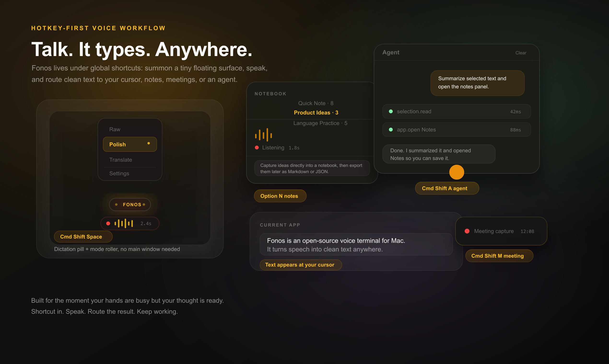
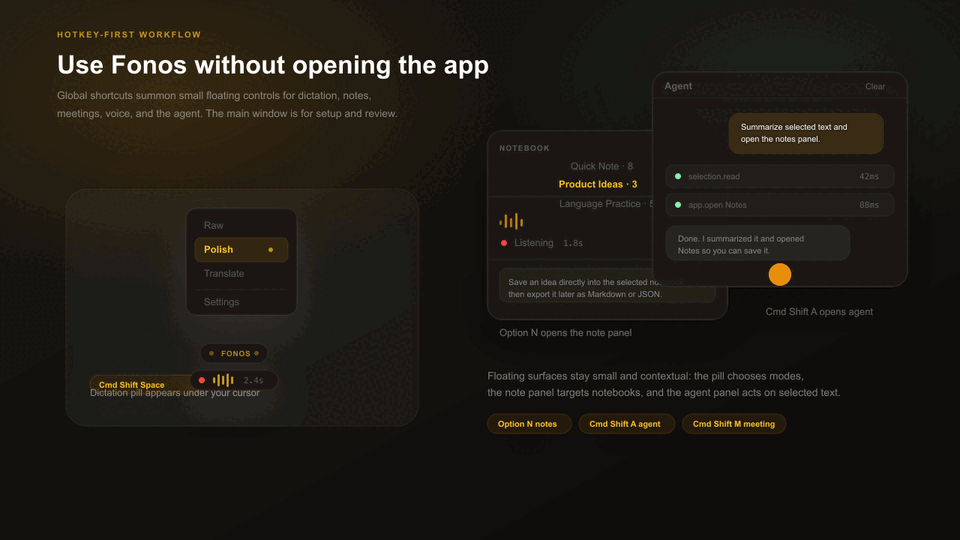
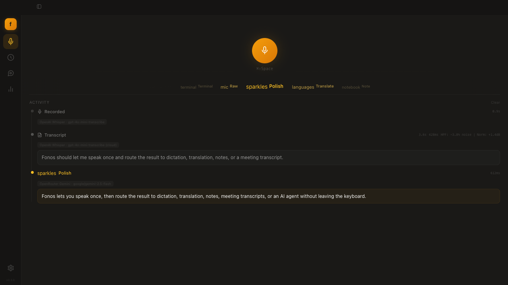
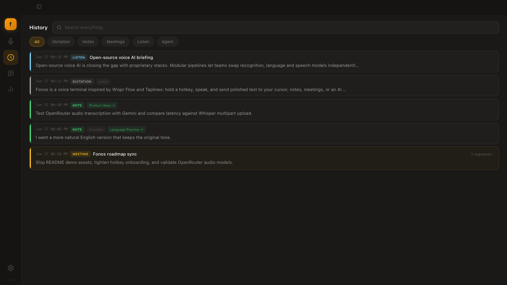
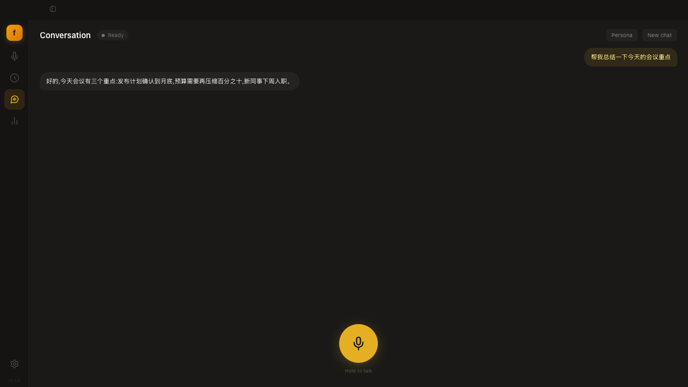
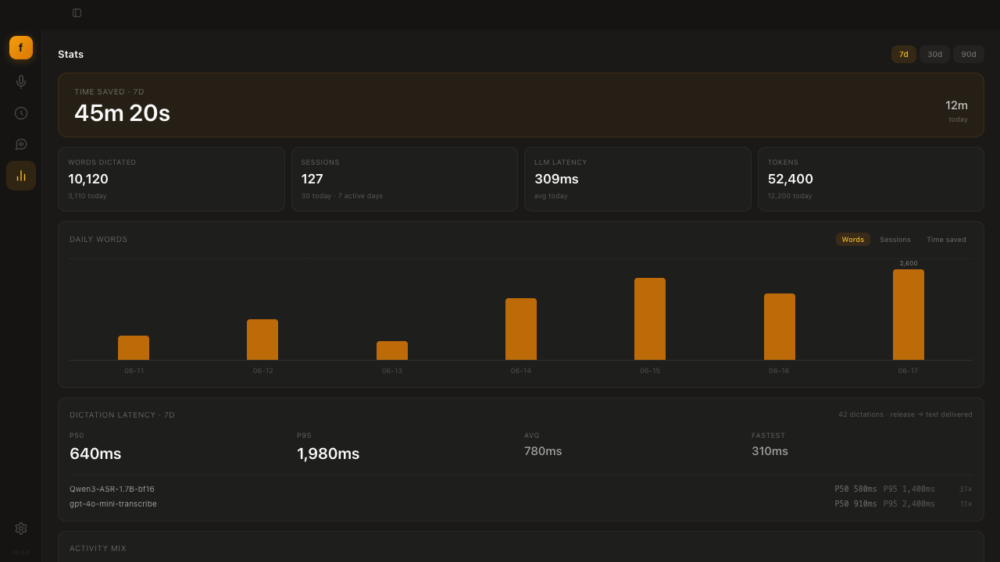
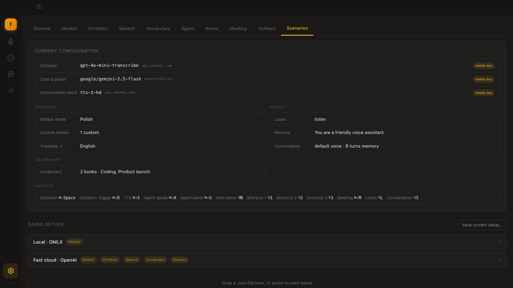
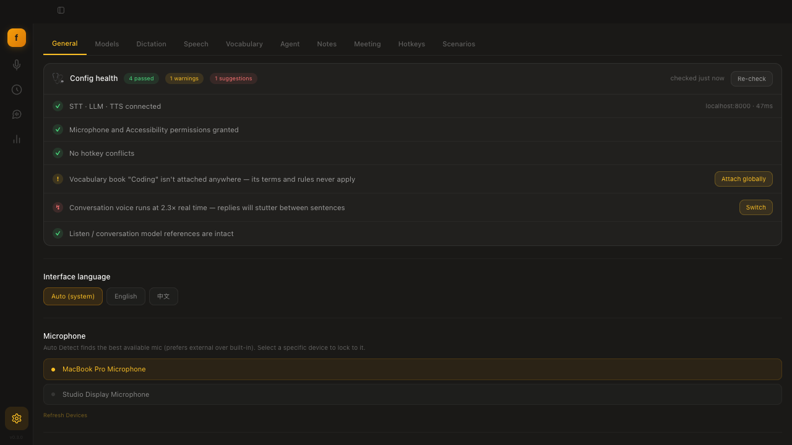
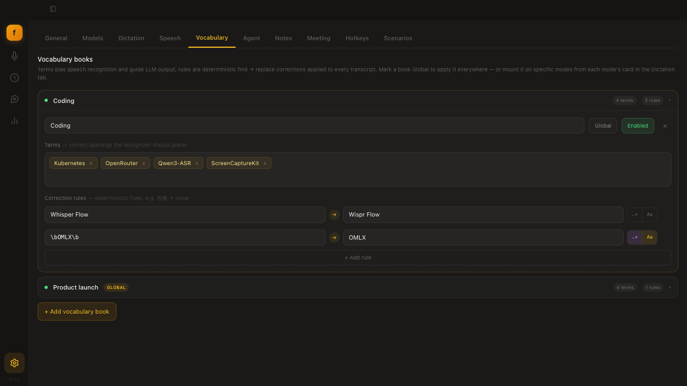

# Fonos

**A hotkey-first voice terminal for dictation, listening, and spoken agents.**
Inspired by Wispr Flow and Taplines, Fonos lets you press a shortcut, speak
naturally, and send the result to the place you actually need it: the cursor,
clipboard, notebook, meeting transcript, listen queue, or AI agent.




Fonos is **open source, local-first, and provider-agnostic**. Bring your own
OpenAI, OpenRouter, Anthropic, Google, OMLX, Ollama, LM Studio, vLLM, or
OpenAI-compatible endpoint. Keys, transcripts, notebooks, meeting notes,
latency stats, and configuration stay on your machine.

## Why Fonos

Most of the app is designed to stay out of the way. You use global hotkeys and
small floating controls for the common paths, then open the full app only when
you want history, setup, stats, or deeper editing.

| Workflow | Shortcut | What happens |
|---|---:|---|
| Dictate anywhere | `Cmd+Shift+Space` | Hold to speak, release to transcribe, clean up, and paste at the cursor. |
| Listen to selected text | `Option+L` | Summarize selected text, generate a title, synthesize speech, and save it to History. |
| Talk with an agent | `Option+S` | Hold to talk, get a spoken reply, and keep short multi-turn memory. |
| Capture notes | `Option+N` | Route speech into notebooks with custom prompts and quick notebook hotkeys. |
| Capture meetings | `Cmd+Shift+M` | Record mic plus system audio, then generate transcripts, decisions, and action items. |
| Fix recognition | History selection | Select a wrong word and turn the correction into a reusable vocab rule. |

## Demo



## Screenshots

| Dictation pipeline | Unified History |
|---|---|
|  |  |

| Spoken conversation | Usage and latency stats |
|---|---|
|  |  |

| Scenario setup | Setup Doctor |
|---|---|
|  |  |

| Vocabulary books |
|---|
|  |

## Feature Map

### Hotkey-first dictation

- Press and hold `Cmd+Shift+Space`, speak, and release. Fonos records,
  transcribes, optionally runs an LLM mode, and delivers the final text.
- Built-in modes include Raw, Polish, Translate, Note, and custom modes with
  their own prompt, STT profile, LLM profile, temperature, paste behavior, and
  vocabulary mounts.
- The float pill shows recording, processing, completion, and error states.
  The app waits until the full pipeline is done before showing `Done`.
- Text injection can use fast paste or direct typing, with per-app override
  rules, failure detection, and reliable clipboard restoration.
- STT, LLM, permission, and injection errors are surfaced where the user is
  already looking: the floating control and the app activity feed.

### Listen queue

- Select text in any app, press `Option+L`, and Fonos creates a listenable
  item: title, summary or rewrite, synthesized audio, and a History entry.
- Conversation and Listen can use separate voice profiles, so fast
  conversational voices do not have to be the same as long-form reading voices.
- Voices are discovered dynamically from the configured TTS backend, with
  preview support where the provider exposes it.

### Real-time conversation

- The Talk page and global `Option+S` hotkey turn Fonos into a spoken agent:
  STT -> persona-aware LLM -> TTS.
- Conversation keeps configurable short-term memory and supports persona
  overrides.
- TTS is paced by clauses. Slow voices get natural pauses; fast voices can
  stream more continuously. Markdown and emoji are stripped before speech so
  replies sound like speech, not chat output.

### Notes, meetings, and search

- Notebooks can have their own prompts, STT/LLM model choices, and hotkey
  bindings.
- Meeting capture records mic and system audio as separate channels where the
  platform supports it, then produces transcripts, summaries, decisions, and
  action items.
- History now unifies Recent, Search, Notes, Meetings, Listen, and Agent
  activity in one view, with type filters and cards tailored to each item.
- Full-text search supports the whole local capture history.

### Vocabulary and correction

- Vocabulary books combine domain terms, STT recognition bias, LLM glossary
  alignment, and deterministic correction rules.
- Rules support literal replacements and regular expressions.
- Books can be mounted globally or attached to specific modes.
- Correction grows from use: select a bad transcript span in History, correct
  it, and save it as either a term or rule.

### Setup and reliability

- Scenario setup replaces a generic first-run wizard with ready-made model
  stacks: local, cloud, or zero-cost. Scenarios can save and restore models,
  dictation settings, speech settings, vocabulary, and hotkeys.
- Local endpoints can be probed and classified automatically. Fonos can inspect
  model names, assign STT/LLM/TTS roles, and benchmark TTS real-time factor.
- Setup Doctor checks endpoint reachability, permissions, config references,
  vocabulary mounts, hotkey conflicts, and TTS speed, then offers one-click
  fixes for common problems.
- Dictation latency is recorded per request. Stats show P50/P95, averages,
  per-model breakdowns, words, sessions, tokens, and estimated time saved.
- Local model warm-up reduces first-dictation cold starts.

### Agent safety

- Voice can drive an AI agent, but command execution is guarded by allowlists,
  blocklists, timeouts, and visible execution state.
- Dictation content is treated as data, not as trusted instructions, in
  transformation pipelines.

## Architecture

Fonos uses a hexagonal architecture. The platform-neutral `fonos-core` crate
owns pipeline events, provider clients, vocabulary, correction, storage,
statistics, scenarios, setup checks, Listen, and speech-to-speech conversation.
The desktop app is a Tauri shell that adapts audio capture, hotkeys, text
injection, windows, permissions, and UI notifications.

```text
audio or selected text
  -> STT / Listen / Talk pipeline
  -> vocabulary terms and deterministic rules
  -> optional LLM mode or persona response
  -> text injection, History, TTS, or floating UI event
```

The same core can be embedded by other shells. See
[`fonos-core/README.md`](fonos-core/README.md) and
[`ARCHITECTURE.md`](ARCHITECTURE.md) for the interface guide.

## Providers

Configure model profiles in **Settings -> Models**, then assign them globally,
per mode, per notebook, or through saved scenarios.

| Provider | Roles | Notes |
|---|---|---|
| OpenAI | STT, LLM, TTS | Whisper-style transcription, GPT models, and hosted voices. |
| OpenRouter | STT, LLM | Audio-capable chat models through chat-completions. |
| Anthropic | LLM | Claude models for transformation, notes, meetings, and agents. |
| Google | LLM | Gemini models through the Generative Language API. |
| OMLX / vLLM | STT, LLM, TTS | Local OpenAI-compatible stacks, including Qwen ASR and Kokoro-style voices. |
| Ollama | LLM | Local chat models on `localhost:11434`. |
| LM Studio | LLM | Local OpenAI-compatible chat on `localhost:1234`. |
| Custom | Any | Any compatible endpoint with explicit base URL and model profile. |

STT supports two API paths: Whisper-compatible multipart upload and
chat-completions with base64 audio for multimodal models.

## Install

### macOS

Download the latest `.dmg` from
[Releases](https://github.com/ethannortharc/fonos/releases/latest), open it,
and drag Fonos to Applications. Apple Silicon and macOS 13.0+ are the primary
targets.

### Linux

Download the `.deb` or `.rpm` package from
[Releases](https://github.com/ethannortharc/fonos/releases/latest):

```bash
sudo apt install ./fonos_*.deb    # Debian / Ubuntu
sudo dnf install ./fonos-*.rpm    # Fedora / RHEL
```

Text injection on Linux needs `xdotool`:

```bash
sudo apt install xdotool
```

On Wayland, paste-at-cursor works through XWayland.

## Build From Source

**Prerequisites**

- [Rust](https://rustup.rs) stable and the Tauri CLI:
  `cargo install tauri-cli --version "^2"`
- [Node.js](https://nodejs.org) 20+
- macOS: Xcode Command Line Tools (`xcode-select --install`) for the Speech and
  ScreenCaptureKit helpers
- Linux: the system packages listed in
  [`.github/workflows/build-linux.yml`](.github/workflows/build-linux.yml)

**Run the desktop app**

```bash
git clone https://github.com/ethannortharc/fonos.git
cd fonos/fonos-desktop
npm ci
cargo tauri dev
```

**Package a release**

```bash
cargo tauri build
```

The compiled macOS helper binaries are checked in. To rebuild them after
editing Swift sources:

```bash
./src-tauri/swift/build.sh
```

## Keyboard Shortcuts

All shortcuts are remappable in **Settings -> Hotkeys**.

| Shortcut | Action |
|---|---|
| `Cmd+Shift+Space` | Hold-to-dictate |
| `Cmd+Shift+D` | Toggle dictation |
| `Option+L` | Listen to selected text |
| `Option+S` | Hold-to-talk conversation |
| `Cmd+Shift+S` | Text-to-speech |
| `Cmd+Shift+A` | Agent speak |
| `Cmd+Shift+G` | Toggle agent panel |
| `Option+N` | Note panel |
| `Option+1/2/3` | Quick notebooks |
| `Cmd+Shift+M` | Meeting capture |

## Repository Layout

| Path | What it is |
|---|---|
| [`fonos-desktop/`](fonos-desktop) | Tauri desktop app: Rust backend plus React / TypeScript UI. |
| [`fonos-core/`](fonos-core) | Platform-independent Rust core: pipelines, clients, vocab, storage, stats, scenarios, doctor, Listen, and Talk. |
| [`fonos-ios/`](fonos-ios) | SwiftUI companion app experiments: app, keyboard extension, widget, and App Intents. |
| [`assets/`](assets) | README hero, screenshots, and demo media. |
| [`experiments/`](experiments) | Exploratory prototypes such as desktop companion experiments. |

## Tech Stack

Desktop: Tauri 2, Rust, React 19, TypeScript, Vite, Tailwind CSS, SQLite
(`rusqlite`). macOS speech and system-audio capture use Swift helpers built on
Speech and ScreenCaptureKit.

Core: Rust crates for STT, LLM, TTS, vocabulary, statistics, scenarios, setup
validation, storage, and platform ports.

## Contributing

Issues and pull requests are welcome. Useful checks:

```bash
cargo test
cd fonos-desktop && npm run build
cd fonos-desktop && npm run test:e2e
```

Some desktop tests need microphone and Accessibility permissions. Please keep
changes focused and match the surrounding style.

## License

[MIT](LICENSE) © Ethan
